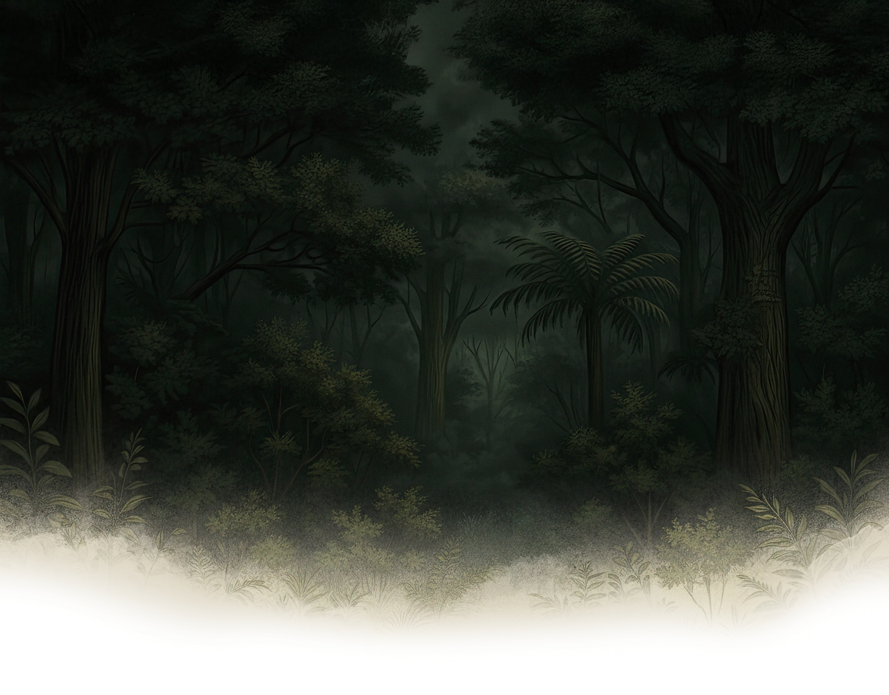

# Rajarshi Lakshman - Developer Portfolio 🌿

A stunning, immersive 3D developer portfolio meticulously crafted with an earthy jungle aesthetic. This portfolio leverages modern web technologies, WebGL shaders, smooth scrolling, and beautiful native 3D interactions to create a highly memorable user experience.



## 🚀 Live Demo
You can view the live production build here: [**rajarshi-portfolio.vercel.app**](https://rajarshi-portfolio-r99c3z8cn-rajarshi0822s-projects.vercel.app) *(Replace with your actual domain later!)*

## ✨ Key Features
- **Jungle Aesthetic Theme:** A deep, cohesive design system using rich forest greens, emerald, lime, and amber tones, transitioning seamlessly from a full-page beautiful landscape photograph.
- **Custom GLSL Dissolve Shader:** Built with `Three.js` and `@react-three/fiber`, the hero section dynamically dissolves on scroll using Fractional Brownian Motion (fbm) noise, blending beautifully with the user's scroll position.
- **Buttery Smooth Scrolling:** Integrated with `Lenis` to provide a premium, inertia-based smooth scrolling experience that syncs perfectly with GSAP scroll-triggers.
- **Atropos 3D Interactive Cards:** The 'My Works' repository cards feature powerful, touch-friendly 3D parallax hover mechanics natively powered by `Atropos`.
- **Live GitHub Integration:** Dynamically fetches and displays GitHub statistics, languages, and open-source contributions directly using the GitHub API.
- **Custom SVG Leaf Cursor:** A responsive, interactive leaf-themed cursor that expands and reacts to links and buttons across the site.

## 🛠️ Technology Stack
- **Framework:** React 19 + Vite
- **Styling:** Tailwind CSS v4 & custom CSS
- **Animations:** Framer Motion & GSAP
- **3D / WebGL:** Three.js, React Three Fiber (R3F)
- **Scroll & Parallax:** Lenis API & Atropos.js
- **Icons:** React Icons (Feather)

## 📦 Installation & Setup

1. **Clone the repository:**
   ```bash
   git clone https://github.com/rajarshi0822/portfolio-website.git
   cd portfolio-website
   ```

2. **Install dependencies:**
   ```bash
   npm install
   ```

3. **Configure Environment Variables:**
   Create a `.env.local` file in the root directory and add your GitHub username:
   ```env
   VITE_GITHUB_USERNAME=your-username
   ```

4. **Run the development server:**
   ```bash
   npm run dev
   ```
   Open `http://localhost:5173` to view it in the browser.

5. **Build for Production:**
   ```bash
   npm run build
   ```

## 📂 Project Structure
- `src/components/` - All React components (Hero, Projects, Skills, etc.)
- `src/hooks/` - Custom hooks (like `useGitHub` for API fetching)
- `src/index.css` - Global styles, Tailwind variables, and global animations
- `public/` - Static assets like the jungle theme imagery and twigs

## 👨‍💻 Author
**Rajarshi Lakshman**
- LinkedIn: [Your Profile](https://linkedin.com)
- GitHub: [@rajarshi0822](https://github.com/rajarshi0822)

---
*Crafted with immersive digital experiences in mind.*
